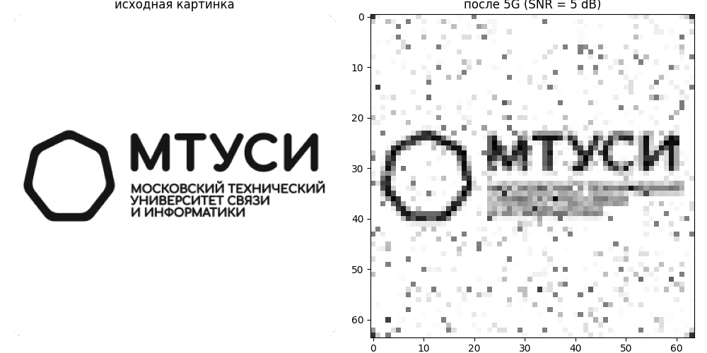
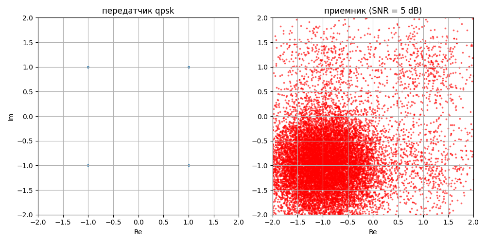

# 5G Video Transmission Model

**Программная модель физического уровня стандарта 5G NR для передачи видеоизображений**

---

## О проекте

Проект демонстрирует, как изображение преобразуется, передаётся по зашумлённому каналу связи и восстанавливается на приёмной стороне, используя технологии, лежащие в основе 5G.

---

## Технологии

- **OFDM** (256 поднесущих) — основа 4G/5G и Wi-Fi
- **QPSK модуляция** — 2 бита на символ
- **AWGN** — моделирование белого шума в канале связи

---

## Результаты

| SNR | Результат |
|-----|-----------|
| 20 dB | Передача без ошибок |
| 10 dB | Лёгкие искажения |
| 5 dB | Сильные искажения |

---

## Визуализация

### Сравнение изображений (SNR = 20 dB)


### Созвездие QPSK


---

## Запуск проекта

```bash
# Установка зависимостей
pip install numpy matplotlib pillow

# Запуск
python video_over_5g.py```

## Автор

**Виктория Комарова** (Vikitoria007)

---

## Лицензия

Проект распространяется под лицензией **MIT**.

Подробнее: [LICENSE](LICENSE)
